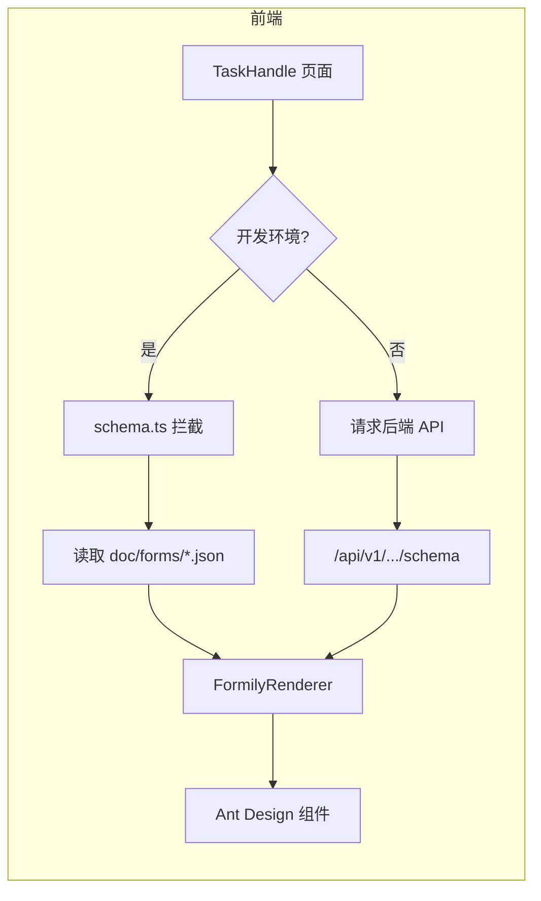
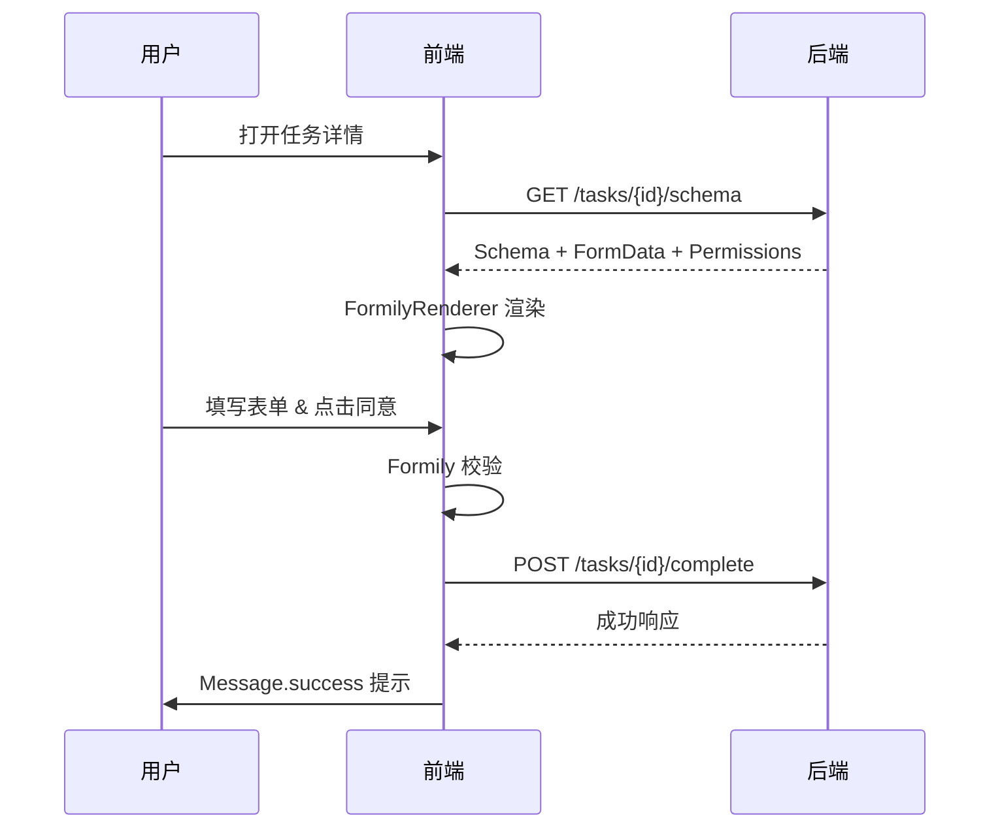

# OA项目管理系统 - 前端系统技术架构白皮书

> **版本号**: v2.0
> **最后更新**: 2025-12-25
> **状态**: 正式版

## 1. 📖 引言

### 1.1 编写目的
本文档旨在明确 "OA项目管理系统" 前端工程的技术路线、核心架构设计、工程规范及关键业务实现的底层逻辑，为开发团队提供统一的技术准则，确保系统的高可维护性、扩展性与安全性。

### 1.2 适用范围
本文档适用于参与本项目的前端开发人员、架构师以及需要进行前后端接口对接的后台开发人员。

---

## 2. 🏗️ 技术选型 (Tech Stack)

本项目采用 **"Modern React"** 现代化技术栈，注重性能、开发体验与类型安全。

### 2.1 核心框架
| 模块 | 技术选型 | 版本 | 选型理由 |
| :--- | :--- | :--- | :--- |
| **View Engine** | **React** | **18.3+** | 业界标准，利用 Hooks 和 Concurrent Mode 提升性能。 |
| **Build Tool** | **Vite** | **7.2+** | 极速冷启动与 HMR 热更新，显著提升开发效率。 |
| **Language** | **TypeScript** | **5.9+** | 强类型约束，构建健壮的企业级应用。 |

### 2.2 UI 与 样式系统
采用 **"CSS-in-JS + Atomic CSS"** 双引擎模式：
*   **组件库**: **Ant Design 5** (v5.29+)
    *   使用 ConfigProvider 实现全局主题 Tokens 配置。
    *   利用 Design Tokens 保持视觉一致性。
*   **原子样式**: **Tailwind CSS v4** (v4.0+)
    *   `src/index.css` 通过 `@theme` 定义与 AntD 一致的 CSS 变量（如 `--color-primary`）。
    *   负责 Layout (Flex/Grid)、Spacing (m/p)、Typography (text-*) 等布局样式。
*   **Icons**: `@ant-design/icons`

### 2.3 核心业务引擎
*   **动态表单**: **Formily** (v2.3+)
    *   **核心价值**: 通过 JSON Schema 驱动渲染 40+ 个复杂业务表单，实现后端配置化表单逻辑，减少前端硬编码。
    *   **架构**: `@formily/core` (模型层) + `@formily/react` (视图层) + `@formily/antd-v5` (组件桥接)。
*   **状态管理**: **Zustand** (v5.0+)
    *   轻量级、Hooks 风格的全局状态管理，用于 UserStore (认证)、ConfigStore (全配置) 等。
*   **网络请求**: **Axios** (v1.13+)
    *   封装拦截器处理 JWT Token 注入、401 自动跳转、全局错误提示。

---

## 3. 🧩 系统架构设计

### 3.1 动态表单渲染架构 (Form Data Driven)
系统核心是 **Process Center (流程中心)**，其业务表单全部由后端下发 JSON Schema 驱动渲染。

1.  **Schema 来源层**:
    *   **Remote**: 生产环境从后端 API (`/api/v1/form-permissions/runtime/...`) 获取带权限控制的 Schema。
    *   **Local Mock**: 开发环境通过 `src/services/schema.ts` 拦截，优先读取 `src/mocks/schemas/*.json`。
2.  **渲染适配层**:
    *   `FormilyRenderer` 组件接收 Schema。
    *   解析 `x-pattern` (readPretty/editable/disabled) 控制字段状态。
    *   通过 `x-reactions` 实现字段联动（如：选择“是”显示隐藏面板）。
3.  **UI 呈现层**:
    *   自动映射到 Ant Design 组件 (Input, Select, DatePicker, Upload)。

#### 📊 Schema 加载流程图


#### 📊 任务办理时序图


### 3.2 安全架构 (Security)
*   **认证 (Authentication)**:
    *   基于 **JWT (JSON Web Token)** 标准。
    *   Token 存储于 localStorage，通过 `userStore` 同步状态。
*   **防泄密水印 (Watermark)**:
    *   全局组件 `WatermarkWrapper` 包裹主要内容区。
    *   动态生成 "用户姓名 + 手机尾号" 水印，防止敏感数据截屏泄露。
*   **权限控制 (RBAC)**:
    *   **菜单级**: 路由守卫根据用户角色过滤菜单。
    *   **字段级**: 表单字段的 Read/Write/Hidden 权限由后端计算后直接注入 Schema，前端无需编写权限判断代码。

### 3.3 目录结构规范
```text
src/
├── assets/                 # 静态资源
├── components/             # 通用业务组件
│   ├── FormilyRenderer/    # [核心] 动态表单引擎
│   ├── ProcessTimeline/    # 流程审批时间线
│   ├── ProcessDiagram/     # BPMN 流程图预览
│   └── WatermarkWrapper/   # 安全水印容器
├── layouts/                # 布局容器
│   ├── MainLayout/         # 核心布局 (ProLayout)
│   └── AuthLayout/         # 登录页布局
├── pages/                  # 页面视图 (按业务域划分)
│   ├── Dashboard/          # 工作台 (Bento Grid)
│   ├── Process/            # 流程中心 (TaskHandle, Initiate)
│   ├── Project/            # 项目中心 (Ledger, Detail)
│   └── Admin/              # 系统管理
├── services/               # API 服务层 (Axios)
│   ├── auth.ts             # 认证服务
│   ├── task.ts             # 任务与流程服务
│   ├── project.ts          # 项目服务
│   └── schema.ts           # Schema 加载策略
├── stores/                 # Zustand 状态仓库
└── utils/                  # 工具函数
```

---

## 4. 🔌 API 接口规范

### 4.1 基础约定
*   **Base URL**: `/api/v1`
*   **Content-Type**: `application/json`
*   **Auth Header**: `Authorization: Bearer <token>`

### 4.2 统一响应格式
```json
{
  "success": true,
  "data": { ... },       // 业务数据 payload
  "error": {             // 仅 success=false 时存在
    "code": "BUSINESS_ERROR",
    "message": "任务已被处理，无法再次提交"
  },
  "timestamp": "2025-12-25T12:00:00Z"
}
```

### 4.3 核心交互流程
#### 4.3.1 任务办理 (Task Execution)
1.  **加载**: 前端调用 `GET /tasks/{taskId}/schema` 获取 `Schema` (表单结构) 和 `Value` (回填数据)。
2.  **渲染**: `FormilyRenderer` 渲染表单，`ProcessTimeline` 渲染审批记录。
3.  **动作**: 用户点击“同意/驳回” -> 前端校验表单 -> `POST /tasks/{taskId}/complete` 提交数据。

#### 4.3.2 动态选人 (Dynamic Assignee)
对于“转办”、“加签”等操作，前端需调用 User Select 组件，选择后将 `targetUserId` 一并提交给后端接口。

---

## 5. 🚀 性能与优化策略

1.  **路由懒加载 (Code Splitting)**:
    *   使用 `React.lazy` 和 `Suspense` 对 `pages/*` 下的页面进行按需加载，减小首屏包体积。
2.  **Schema 缓存优化**:
    *   业务Schema体积较大，建议利用浏览器 HTTP 缓存（配合 ETag），但需确保版本一致性。
3.  **虚拟滚动**:
    *   项目台账 (`ProjectList`) 可能包含数千条数据，`ProTable` 开启 `virtual` 模式保证流畅滚动。
4.  **构建优化**:
    *   Vite 生产环境构建移除 `console.log`，启用 Gzip 压缩。

---
